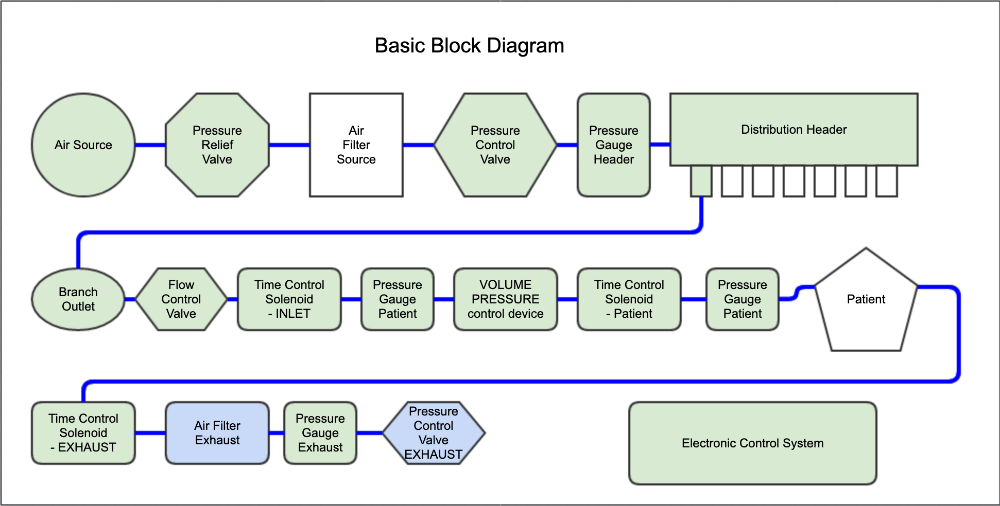
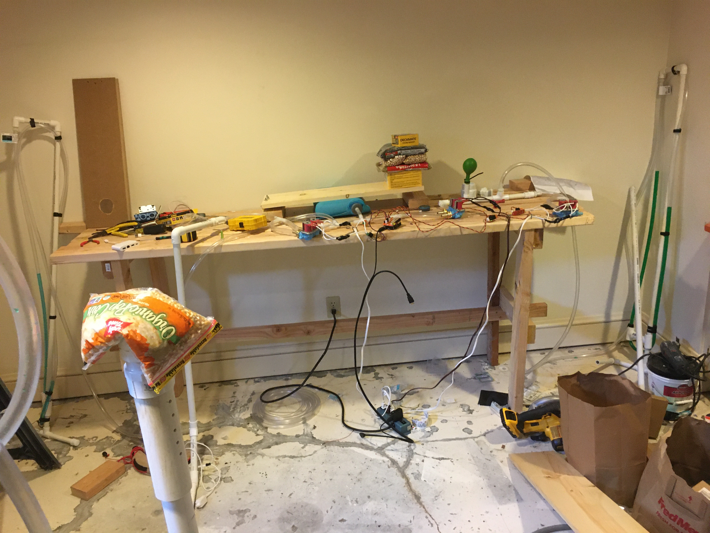

# [Simple Open Ventilator](System/README.md)
--------------------------
## Updates:
4/3/2020:
**Tidal volumes look good around 650mL per breath**
* TODO: PEEP
* TODO: Vary Tidal Volume
* TODO: Capture Tidal Volume, Mass, Speed variation in a chart
* TODO: Write up Test procedures

## **Introduction:**
Team Seldon is producing plans and prototypes of a ventilator that can be built by tradespeople across the planet from locally obtainable materials. The design is OPEN SOURCE, OPEN DESIGN, and OPEN HARDWARE. You can find all of our progress here. If you want to help please contact  - seldonenterprises@protonmail.com. Full details of the build out are [here](/System/README.md)


Starting with the Block Diagram:



The most recent video of progress to date.
[youtube link](https://youtu.be/Anu_NY6iPGQ)
[.MOV link](https://github.com/MakerSeldon/SimpleOpenVentilator/LatestVideo.MOV)

We have a paper we are trying to keep up, but it is a few steps behind the github site - [Description Document](System/COVIDventv3Seldon.pdf)

We also have a lessons learned [page](/System/Lessons/README.md)

------------------
# Design Requests and Requirements
Several groups have come out with design guidelines and requests. We have captured a few of them here. #OSventilator will have more info

* [Vulcan Rapid Vent Requirements](Documents/VULCAN.md)
* [UK Rapid Vent link](https://www.gov.uk/government/publications/coronavirus-covid-19-ventilator-supply-specification/rapidly-manufactured-ventilator-system-specification)
* [Canada](https://www.agorize.com/en/challenges/code-life-challenge/pages/guidelines?lang=en)

-------------
# Progress to date:
Version 0.89 Complete -- Documentation and Testing underway, PEEP still to be implemented. Exhaust side leaking too much.


We are 90% of our goal of being able to create this from all Home Improvement Parts. The controller circuit uses an Arduino and relays we had laying around. Code is posted, circuit is coming.


--------------

# Technical Constraints
We have limits on the total volume, Respiration rate, and max pressure that can be applied to the balloon. The medical industry uses terms of art we need to convert to more traditional engineering terms.

**Tidal Volume** -- Volume of air that needs to be pushed and pulled out of the balloon: 400-700mL. This is a reasonable amount. We can figure this out.

**Pressure mmHg** -- Standard pressure measurement, but we like to work in PSI.
40mmHg == 0.77PSI. This is too small for our normal measuring tools. We need a way to work with this. Mercury is hard to get and poisonous, we will use water.
1mmHg = 0.535776 inH2O, or about 1.3cmH2O very doable and easy.

**Respiration Rate** -- Fill, wait, exhaust cycles. We call this hysteresis. Simple control problems. 5-30 breaths per minute.

# Tunable values
* Tidal Volume 400mL to 600mL
* Respiration Rates 5-30 cycles/min
* Pressure 40mmHg to 60mmHg (21.4 inH2O --> 32 inH2O = Delta 10.6 inches)

# Construction Constraints / Mission
We know we can spend money and time to make very nice ventilators. What can we do when we need many more than can be manufactured in a hurry? Can we leverage local tradesman talent and supplies? If we assume our normal scientific supply chain is broken or too slow we have to move to distributed manufacturing with what is in stock. Our group is taking the Apollo 13 approach. What is available in the local stores, and what can local craftsmen construct? Can this be completed with all in stock parts from a local hardware store?  

# Original Tasks:
* **Create a system absolutely as simple as possible**
* **Create a constant low pressure high volume air supply**
* **Create Safety system to reduce injuries**
* **Create measurement system**
* **Develop and Test Prototype System**
* **Document prototype system**

----------
# Donations
If you want to donate to the project you may donate to a developer directly for parts etc:
```
BTC: 12VbmzcMsj5VtiCuqSdMPihkLPt9UEqHfd
```

Or you can done to a 501(c)3
**The Asymmetrical Biodiversity Studies and Observation Group**
[(ABSOG)](https://threesecondsuntilmidnight.com/absog/)
They are working on a direct donation page on GoFundMe


# Why are we doing this?
COVID-19 has exposed a critical shortage in our medical care capabilities, and supply chain. (REF Italy doc report). Throwing money at the vendors to produce more and faster is unlikely to work in serious world-wide pandemic where supply-chains are shut down, the need for ventilators vastly outstrips the manufacturing capability, or quarantine simply shuts down transportation.


The total number of ventilators available is around 600-800k(1). Of the total ventilators 80% are currently in use for car accidents, surgery recovery, etc. Even if we had 1M and 20% avail that only leave 200k avail. The CDC is predicting over 1M dead in one model. These people might live if ventilators were available. We think we can help, and it is our duty to help. We don't want doctors and nurses having to choose who lives and who dies in the emergency room based on the number of ventilators available.


(1) Based on off the record conversations with USG officials.

# Mission Statement
Henry Watt from Britain during WW2 said --

**'''Watt: The system was deliberately developed using existing commercially available technology to speed introduction.[60] The development team could not afford the time to develop and debug new technology. Watt, a pragmatic engineer, believed "third-best" would do if "second-best" would not be available in time and "best" never available at all. -- quote from wikipedia
'''**

# What we have volunteering part time
- Doc reviewing our effort
- Senior Hydraulic Engineer
- Master Fabricator
- Senior Electrical Engineer

# What we need
- Documentation help
- Fabrication duplication
- Imagineers / Fabricators
- Nurses / PA's
- Makers to help
- Funding for parts & help


-----
# Disclaimer Section
**Lawyers: This project is to demonstrate the possibility**
Due to liability issues
**No warranty of usefulness at all**
* The material on this site is provided with no warranties explicit or implied.
* No material on this site is intended to provide medical advice. All designs are intended for investigational use only.
* The Department of Health and Human Services (DHHS) has declared [liability immunity](https://www.fda.gov/regulatory-information/laws-enforced-fda/federal-food-drug-and-cosmetic-act-fdc-act) for medical countermeasures against COVID-19.
* This site does not represent any official policies or procedures of anybody.
* [ref 1](https://www.phe.gov/Preparedness/legal/prepact/Pages/COVID19.aspx)
* [ref 2](https://www.policymed.com/2020/03/hhs-issues-declaration-exempting-some-from-liability-related-to-covid-19-preparedness.html)
* [ref 3](https://www.modernhealthcare.com/legal/azar-extends-liability-immunity-fight-against-covid-19)
* [ref 4](https://s3.amazonaws.com/public-inspection.federalregister.gov/2020-05484.pdf)
* [Federal Register](https://www.federalregister.gov/documents/2020/03/17/2020-05484/declaration-under-the-public-readiness-and-emergency-preparedness-act-for-medical-countermeasures)

------
# License
Until we get further guidance the project is licensed as such:
* CERN Open Hardware Licence Version 2 - Permissive [license](Documents/license.md)
